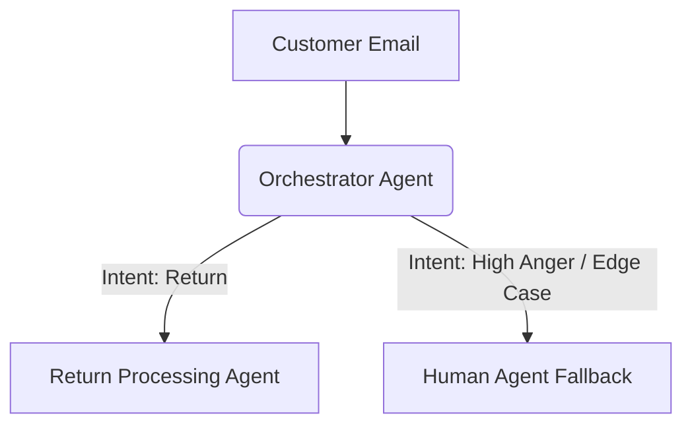

# Lab: Mermaid.js Agentic Blueprinting

## 🎯 Objective
As an AI-Expert Business Analyst, you must be able to visually communicate complex AI architectures to both technical (Engineers) and non-technical (C-Suite) stakeholders. In this lab, you will use Mermaid.js to design a conceptual blueprint for a **Customer Resolution Agentic Swarm**.

## 🏢 Scenario Context
**Problem:** A retail company is receiving thousands of customer emails regarding returns. Currently, human agents read the email, check the CRM, check the warehouse system, and then email the customer back. 
**Goal:** Design an autonomous, multi-agent workflow that handles 80% of these requests without human intervention.

## 🧠 The Agentic Architecture (Conceptual)
You need to design a system with the following components:
1.  **Orchestrator Agent (The Router):** Receives the customer email, determines the intent (e.g., "Return", "Complaint", "Product Question"), and routes it to the appropriate specialized agent.
2.  **Return Processing Agent:** Handles "Return" intents. It needs access to a "CRM Tool" (to verify purchase) and an "Inventory Tool" (to generate a return label).
3.  **Human-in-the-Loop (HITL) Gate:** If the Orchestrator detects high negative sentiment, or if the Return Agent fails to verify the purchase, the workflow must fall back to a Human Customer Success Rep.
4.  **Communication Agent:** Takes the output from the Return Agent and drafts a polite, brand-aligned email to the customer.

## 📝 Exercise: Write the Mermaid Code
Use the Mermaid.js `graph TD` (Top-Down flowchart) syntax to map out this flow.

*Hint: If you are new to Mermaid, use [Mermaid Live Editor](https://mermaid.live/) to practice.*

### Your Task:
Complete the Mermaid code block below to match the architecture described above.

## ✅ Deliverable
A complete, functioning Mermaid diagram that accurately represents the autonomous workflow, including the critical HITL guardrails. You will include this diagram in your Capstone Project.
